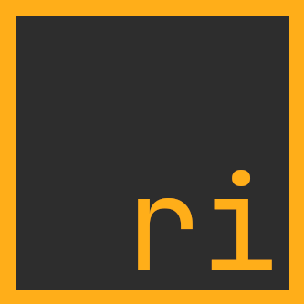

<div align="center">



# The Rivet programming language

A general-purpose programming language, focused on simplicity, safety and stability.

[Documentation](doc/00_getting_started.md)
•
[Roadmap](ROADMAP.md)
•
[Changelog](CHANGELOG.md)
•
[Samples](samples/)


</div>

Rivet's goal is to be a very powerful programming language and at the same time easy
to use, with a syntax inspired mainly by Rust and C# (which are the coolest languages
I've ever seen), and by other languages such as Python, Lua, TypeScript, D, Zig, Go,
etc.

It is true that there are many programming languages and each of them specialized in
a field; some with strange syntax in my opinion (like Lisp) and others with a high
learning curve, but Rivet tries to be an exception by trying to become a unique
language with a clear and simple syntax and a low learning curve.

```rs
// A simple sample: the classic "Hello World"

fn main() void {
    Console::println("Hello World!");
}
```
<sub>More samples in the [`samples/`](samples/) folder</sub>.

## Important note

Currently the language is in alpha state, and therefore its syntax and the language
API is not stable, and may change in the long term. Not all features are implemented.

## Features

* **Easy-to-learn syntax**: A syntax without overload of unnecessary elements.
* **Easy error handling**: Via result types: `fn my_fn() !T { ... }`.
* **Named and optional arguments**: Very useful.
* **Immutable values by default:** Variables and fields of struct are immutable
by default.
* **Polymorphism**: Classes and Traits are supported.
* **Generics:** Specialize and reuse the same code for different types.

* * *

<div align="center">

© 2022 **The Rivet Team**

</div>
