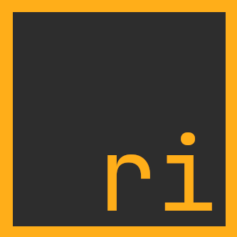

<div align="center">



# The Rivet programming language

A general-purpose programming language, focused on simplicity, safety and stability.

</div>

## Overview

Rivet is a general purpose programming language designed for the development
of stable and safe software. The syntax of the language is inspired by Rust.

Rivet uses the C programming language as its main backend.

Before continuing, I assume you know how to use a console, otherwise you can
read this tutorial:
[The Linux command line for beginners](https://ubuntu.com/tutorials/command-line-for-beginners#1-overview).

## Run the compiler

### Dependencies

* The compiler requires Python 3.

* The Rivet compiler currently generates C code, so a C compiler, which supports C11,
    is required to generate executables. Over time the compiler will add support for
    generating binaries directly without the need for a C compiler.

The compiler has been tested on **linux** and **windows**.

Just execute `python rivetc.py some_file.ri`.

You can see all available compiler options by using the `-h`/`--help` flag.

`python rivetc.py -h`

## Hello World!

Let's start with the typical `Hello World!`:

We create a file called `hello_world.ri` with the following content:
```rs
use core::console;

fn main() {
    console::println("Hello World!");
}
```

Then we compile that file:
```bash
$ python3 rivetc.py hello_world.ri -o hello_world
```

We'll get an executable called `hello_world` as output, so we run it:
```bash
$ ./hello_world
```

We should see this output:
```bash
Hello World!
```

Excellent! You have compiled your first program in Rivet!

## Editor/IDE support

* [LiteXL (the main editor I use :P)](https://github.com/lite-xl/lite-xl-plugins/blob/master/plugins/language_rivet.lua)
(Syntax-highlighting only).

* * *

<div align="center">

[next](01_code_structure.md)

</div>
